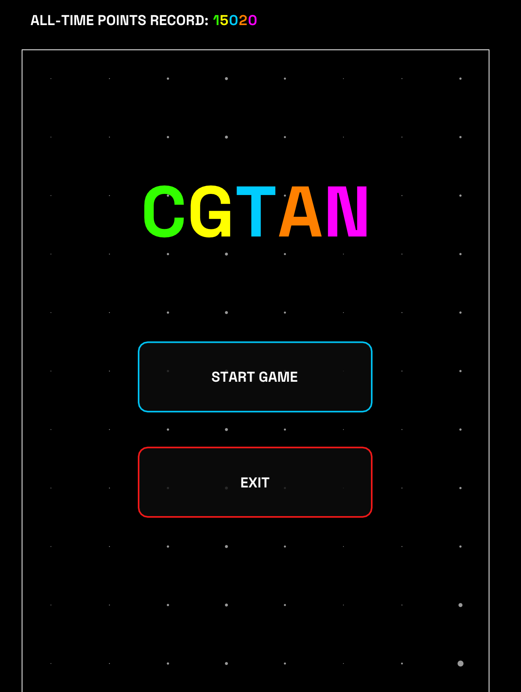
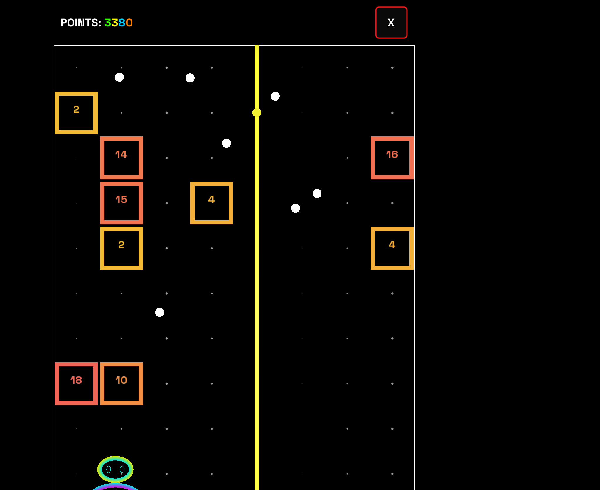

# CGTAN

Project I for the Computer Graphics course (University of Bologna).

<p align="center">
  
  
</p>

## About

CGTAN is a real-time, OpenGL-based breakout/arkanoid-style game. A paddle deflects one or more balls into a grid of destructible blocks; blocks have hit points and drop power-ups when destroyed (extra balls, horizontal/vertical lasers). The game tracks an all-time points record, persisted to disk between runs.

Highlights of the implementation:
- Custom OpenGL rendering pipeline (GLFW + glad), with all game shapes — blocks, balls, lasers, the animated player character — built from raw vertex buffers rather than a modeling tool
- The player character is a small hand-crafted 2D animation built from Hermite-interpolated ellipses (no sprite/texture assets)
- Custom text rendering via FreeType for the HUD and menus
- ImGui-based menu/HUD overlay, kept aligned with the actual OpenGL viewport across window resizes and HiDPI/content-scale differences

## Requirements

- [CMake](https://cmake.org/download/) (>= 3.10)
- A C++17 compiler:
  - **Windows**: Visual Studio (with the "Desktop development with C++" workload) or MinGW-w64
  - **macOS**: Xcode Command Line Tools (`xcode-select --install`)
  - **Linux**: GCC/Clang + OpenGL development packages (e.g. `libgl1-mesa-dev` on Debian/Ubuntu)

Third-party libraries (GLFW, Freetype, GLM, ImGui) are downloaded and built automatically by CMake on the first `cmake ..` (via `FetchContent`): **an Internet connection is required** the first time. Only glad is vendored directly under `libs/` (it's generated code, not a library to fetch).

## Build

From a terminal, inside the project folder:

```bash
mkdir build
cd build
cmake ..
cmake --build .
```

CMake picks the generator (Visual Studio, MinGW, Make, etc.) automatically based on what's available on the system. `cmake --build .` works regardless of which generator was chosen.

The first build takes a few extra minutes to download and compile the dependencies; subsequent builds are as fast as a normal project.

## Run

The executable is called `CGTAN` (`CGTAN.exe` on Windows, typically under `build/Debug/` or `build/Release/` depending on the generator; directly under `build/` on macOS/Linux).

```bash
./CGTAN
```
